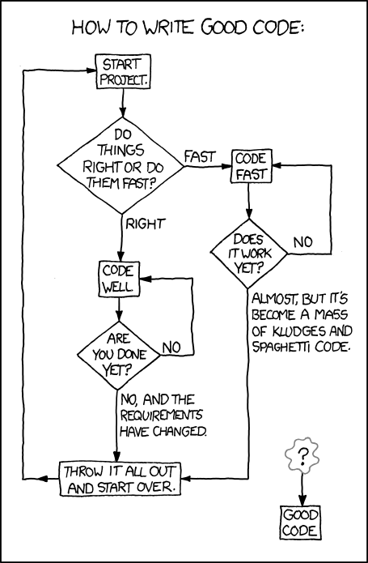

::: nav-pills
::: panel-tabset

## home

::: {.grid}

::: {.g-col-2}
:::

::: {.g-col-8}

:::

::: {.g-col-2}
:::

:::

::: {.grid}

::: {.g-col-6}

###   Coordinates

- **Where**: SSB 134 (theory) & DCF (lab)
- **When**: 
  - Theory - Wed (11 am), Thu (3 pm), Fri (8 am)\
  - Lab - Thu (9 am - 12 pm)

###  Course staff

- **Instructor**: [Yadu Vasudev](https://yaduvasudev.github.io/) (yadu@cse.iitm.ac.in)
- **TAs**: 
  - Durwasa (cs24d011@smail)
  - Aryan (cs26m006@smail)
  - Harshavardhan (cs26m010@smail)
  - Faheem (cs26m014@smail)
  - Sathvik (cs26m015@smail)
  - Nimish (cs26m020@smail)
  - Prakash (cs26m021@smail)
  - Katherine (cs26m023@smail)
  - Sai Teja (cs26m030@smail)
  - Gaurav (cs26m044@smail)
  - Tanuj (cs26m045@smail)
  - Nithin (cs26m046@smail)
  - Aditya (cs25m007@smail)
  - Yukash (cs23b069@smail)
  - Meghana (cs23b053@smail)
  
:::

::: {.g-col-6}

###  Important links

- [Moodle](https://courses.iitm.ac.in/course/view.php?id=12232) 
- [Ed Discussions](https://edstem.org/us/courses/100619/) \
  Join using your smail/iitm ids via [this link](https://edstem.org/us/join/YMQcyF)
- [Anonymous course feedback](https://forms.gle/fs8ZNzqKoeo2t9HF8)

:::

:::
---

::: {.grid}

::: {.g-col-12}

###  Course calendar

<<iframe src="https://calendar.google.com/calendar/embed?height=600&wkst=2&ctz=Asia%2FKolkata&showPrint=0&mode=WEEK&src=Y18yNmI5ZjM4MWJlOThlNDA1ZjdjOGVkNGM1YTYzMTlmZDZhNGYwMWE2OTY3MTE3Y2M3MTk3ZDJkODVmMjkwODgwQGdyb3VwLmNhbGVuZGFyLmdvb2dsZS5jb20&color=%23ad1457" style="border:solid 1px #777" width="1100" height="600" frameborder="0" scrolling="no"></iframe>>

:::

:::
  
## contents

::: {.grid}

::: {.g-col-10}

####  About this course

This course introduces computational thinking and programming using C language. As the title suggests, the objective is to enable the student to understand abstractions, break complex computational tasks to smaller ones and use programming to solve the smaller tasks and combine them together into a final solution. At the end of the course, the student will be able to apply computational thinking to solve complex problems and implement the solutions using the C programming language.

The laboratory component of the course will involve implementing the theoretical concepts covered in the lectures.

**Prerequisites** - There are no formal prerequisites for the course, apart from high-school mathematics. This course, together with CS1200, is a prerequisite for almost all courses in the CS curriculum.

---

####  Course contents

The following is a brief overview of the course

- Computational thinking and abstractions using examples, simple programs
- C programming: basic syntax, variables, conditional statements, loops 
- Arrays and their uses in data manipulation
- Modular programming, functions, and scopes of variables
- Recursion and their applications
- Dynamic memory allocation and pointers
- Aggregate data types - structures and unions
- Self-referential structures and simple data structures
- File handling

---

####  Course resources

The main reference for the course will be the slides and the following references.

- C: How to Program - Dietel and Dietel
- The C Programming Language - Kernighan and Ritchie
- How to Solve it by Computer - Dromey

:::

:::

## administrivia

::: {.grid}

::: {.g-col-10}

####  Weekly schedule

There are three lecture slots per week, and one lab session. Some of the lab sessions will be graded and we will let you know in advance so that you can prepare accordingly. We will have short pop quizzes within the lectures as a means to reinforce the concepts taught in class.

You are welcome to use the course discussion forum to clarify doubts with the instructor and the TAs. All the TAs and the instructor will also be present during the lab sessions to help you with the lab work, including the graded sessions.

---

####  Grading policy (tentative)

- Lab: 30%
- Pop-quizzes/class participation: 5% 
- Quiz 1: 10%
- Quiz 2: 15%
- End-semester exam = 40%

---

####  Important dates (tentative)

- Graded labs: Aug 20, Sep 3, Sep 10, Sep 24, Oct 8, Oct 29, Nov 5
- Ungraded labs: Aug 6, Aug 13, Aug 27, Sep 17, Oct 1, Oct 15
- Quiz 1: Aug 28 (Friday)
- Quiz 2: Oct 13 (Tuesday)
- End-semester examination: November 18 (Wednesday) 

---

####  Communication

Please sign up on the course discussion forum [here](https://edstem.org/us/join/YMQcyF). This will be the first point of contact for any issues related to the course. For general questions related to the course (any comments/doubts), please create a thread in the correct category and add your question/comment there. You are encouraged to reply and clear the doubts of your friends. To encourage this interaction, **the forum supports anonymous posts and answers**. **Please be courteous to others when you are posting anonymously**.

:::

:::

## lectures

::: {#lectures}

:::

:::

:::
